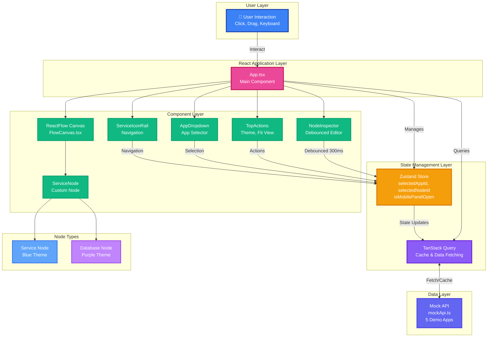

# ReactFlow Canvas

A modern, interactive application graph builder featuring a visual node editor for microservices architecture. Built with React, ReactFlow, and TypeScript, this application provides an intuitive interface for visualizing and managing service dependencies with real-time editing capabilities.


> **📖 Architecture Deep Dive**: See [reasoning.md](reasoning.md) for detailed explanation of component refactoring decisions and architectural choices.

## ✨ Features

### 🎨 Interactive Canvas
- **Drag & Drop** - Fully draggable nodes with smooth positioning
- **Zoom & Pan** - Intuitive canvas navigation with mouse/trackpad
- **Auto-Layout** - Smart node arrangement (single, side-by-side, T-shape, pyramid, grid)
- **Fit View** - Auto-center canvas to display all nodes
- **Dotted Background** - Clean visual grid for better spatial awareness

### 🔧 Node Management
- **Dual Node Types** - Distinct styling for Services (blue) and Databases (purple)
- **Real-time Editing** - Live updates with debounced text inputs (300ms)
- **Status Monitoring** - Color-coded status indicators (Healthy/Degraded/Down)
- **Metrics Dashboard** - CPU, memory, disk, and region information
- **Service Icons** - Branded logos for 30+ services (AWS, Azure, PostgreSQL, Redis, MongoDB, etc.)

### ⌨️ Keyboard Shortcuts
- **`F`** - Fit view to show all nodes
- **`P`** - Toggle right inspection panel
- **`Escape`** - Close panel or deselect node
- **`Delete`/`Backspace`** - Delete selected node
- **`?`** or **`Ctrl+/`** - Show keyboard shortcuts help

### 📱 Responsive Design
- **Mobile-First** - Slide-over drawer for panels on mobile devices
- **Adaptive Layout** - Seamless experience across all screen sizes
- **Touch Support** - Full gesture support for mobile canvas interaction

### 🎯 Advanced Features
- **Multi-App Support** - Switch between different application graphs
- **Live Search** - Filter applications with real-time search
- **Theme Toggle** - Dark/Light mode with persistent state
- **Query Caching** - TanStack Query for optimized data fetching
- **Error Simulation** - Toggle-able failure mode for testing error states
- **Inspector Tabs** - Config and Runtime views for node properties

## 🏗️ Architecture

### System Architecture Overview



**Component Interaction Flow:**

1. **User Interaction** → UI Components (Click, Drag, Keyboard)
2. **UI Components** → Zustand Store (State Updates)
3. **Zustand Store** → TanStack Query (Data Mutations)
4. **TanStack Query** → Mock API (Fetch/Mutate)
5. **Mock API** → TanStack Query (Response with Latency)
6. **TanStack Query** → Components (Re-render with New Data)

**Key Architectural Patterns:**

- **Unidirectional Data Flow** - Data flows from API → Query → Store → Components
- **Optimistic Updates** - UI updates immediately, syncs with server later
- **Debouncing** - Text inputs wait 300ms before triggering updates
- **Query Caching** - TanStack Query caches all API responses
- **Immutable State** - All state updates use immutable patterns
- **Component Composition** - Small, focused components with single responsibility

### Tech Stack
| Category | Technology |
|----------|-----------|
| **Framework** | React 19.2 with React DOM |
| **Language** | TypeScript 5.9 (Strict Mode) |
| **Build Tool** | Vite 7.2 |
| **Canvas** | ReactFlow 12.3 (@xyflow/react) |
| **State Management** | Zustand 5.0 |
| **Data Fetching** | TanStack Query 5.90 |
| **Styling** | Tailwind CSS 3.4 |
| **UI Components** | shadcn/ui (Radix UI primitives) |
| **Icons** | Lucide React + React Icons |
| **Linting** | ESLint 9 (Flat Config) + Prettier |

### Project Structure
```
src/
├── components/
│   ├── graph/
│   │   ├── FlowCanvas.tsx      # Main ReactFlow canvas wrapper
│   │   └── ServiceNode.tsx     # Custom node component
│   ├── layout/
│   │   ├── AppList.tsx         # Application list sidebar
│   │   ├── AppDropdown.tsx     # App selector dropdown
│   │   ├── NodeInspector.tsx   # Node property editor panel
│   │   ├── ServiceIconRail.tsx # Left navigation icons
│   │   ├── TopActions.tsx      # Top toolbar actions
│   │   ├── CreateAppDialog.tsx # New app creation modal
│   │   ├── AppDeleteButton.tsx # Delete confirmation
│   │   └── KeyboardShortcuts.tsx # Shortcuts help overlay
│   └── ui/                     # shadcn/ui components
├── hooks/
│   └── useAppData.ts           # Custom data fetching hook
├── lib/
│   ├── mockApi.ts              # Mock API with 5 demo apps
│   └── utils.ts                # Utility functions
├── store/
│   └── appStore.ts             # Zustand global state
├── utils/
│   ├── getAppIcon.tsx          # App icon resolver
│   └── getServiceLogo.tsx      # Service logo resolver
├── types.ts                    # TypeScript definitions
├── App.tsx                     # Main application component
└── main.tsx                    # Application entry point
```

### State Management
**Zustand Store** (`appStore.ts`)
- `selectedAppId` - Currently active application
- `selectedNodeId` - Selected node for inspection
- `isMobilePanelOpen` - Mobile drawer state
- `activeInspectorTab` - Active tab (config/runtime)
- `shouldFail` - Error simulation toggle

### Data Flow
1. **TanStack Query** fetches mock data with simulated latency
2. **Zustand** manages UI state and selections
3. **ReactFlow** handles canvas interactions and node positioning
4. **Debounced updates** optimize performance for text inputs
5. **Cache invalidation** ensures consistency on mutations

## 🚀 Getting Started

### Prerequisites
- **Node.js** 18+ or 20+ (LTS recommended)
- **npm** 9+ or **yarn** 1.22+ or **pnpm** 8+
- A modern web browser (Chrome, Firefox, Safari, Edge)
- Git for version control

### Setup Instructions

#### 1. Clone the Repository
```bash
git clone <repository-url>
cd ReactFlow-Canvas
```

#### 2. Install Dependencies
```bash
npm install
```

This will install all required packages including:
- React 19.2 and ReactFlow 12.3
- TypeScript 5.9 and Vite 7.2
- Zustand, TanStack Query, Tailwind CSS
- shadcn/ui components and icon libraries

#### 3. Start Development Server
```bash
npm run dev
```

The application will be available at `http://localhost:5173`

Vite will provide:
- ⚡ Lightning-fast Hot Module Replacement (HMR)
- 🔄 Instant updates without full page reload
- 📊 Built-in dev server with proxy support

#### 4. Build for Production
```bash
npm run build
```

This will:
1. Run TypeScript type checking
2. Create optimized production build in `dist/`
3. Minify and bundle all assets

#### 5. Preview Production Build
```bash
npm run preview
```

Test the production build locally before deployment.

### Available Scripts

| Command | Description | When to Use |
|---------|-------------|-------------|
| `npm run dev` | Start Vite dev server with HMR | Development |
| `npm run build` | Type-check and build for production | Before deployment |
| `npm run preview` | Preview production build locally | Testing production build |
| `npm run lint` | Run ESLint on all source files | Code quality checks |
| `npm run typecheck` | Run TypeScript type checking | Type validation |

### Environment Setup

No environment variables are required for basic setup. The application uses mock data by default.

For custom configuration, you can create a `.env` file:
```env
VITE_API_BASE_URL=http://localhost:3000  # Optional: Real API endpoint
VITE_ENABLE_DEV_TOOLS=true               # Optional: Enable React Query DevTools
```

## 📖 Usage Guide

### Creating a New Application
1. Click the **"+ Create App"** button in the app list
2. Enter an app name and select an icon
3. Click **"Create"** - a new empty graph will be initialized

### Adding Nodes
1. Select an application from the dropdown or list
2. Click the **"+"** button in the left icon rail
3. A new node (service or database) will be added with random properties
4. Drag nodes to arrange them on the canvas

### Editing Nodes
1. Click any node to select it
2. The right panel opens showing node properties
3. Edit the **name**, **description**, or **scale** value
4. Changes are saved automatically with debouncing

### Deleting Items
- **Delete Node**: Select a node and press `Delete` or `Backspace`
- **Delete App**: Click the trash icon next to the app name

### Testing Error States
- Click the **lightning bolt icon** in the top bar
- The next API call will fail, showing error UI
- Useful for testing loading and error states

## 🎨 Customization

### Adding New Services
Edit `src/utils/getServiceLogo.tsx` to add custom service icons:

```typescript
if (name.includes('myservice')) {
  return <CustomIcon className={`${iconSize} text-blue-500`} />
}
```

### Modifying Node Styling
Edit `src/components/graph/ServiceNode.tsx` to customize node appearance:

```typescript
const nodeStyles = isDatabase
  ? { background: 'purple-gradient', borderColor: 'purple' }
  : { background: 'blue-gradient', borderColor: 'blue' }
```

### Configuring Auto-Layout
Adjust positioning logic in `src/lib/mockApi.ts`:

```typescript
function autoArrangeNodes(nodes: any[]) {
  // Modify spacing, centerX, topY, bottomY values
  const spacing = 320
  const centerX = 520
  // ... custom layout logic
}
```

## 🧪 Development

### Code Quality
- **Strict TypeScript** - All type errors must be resolved
- **ESLint** - Enforces React best practices and hooks rules
- **Prettier** - Code formatting (integrated with ESLint)

### Key Architecture Decisions

#### 1. **State Management Strategy**
- **Zustand for UI State**: Lightweight (< 1KB) and simple API for global UI state
- **TanStack Query for Server State**: Automatic caching, background refetching, and error handling
- **React State for Local State**: Component-specific state like form inputs

**Why?** Separation of concerns - UI state, server state, and local state each have different lifecycles and requirements.

#### 2. **Debounced Input Updates (300ms)**
- Text inputs (name, description) use local state with debounced updates
- Slider updates happen immediately without debouncing
- Prevents excessive re-renders and API calls

**Why?** Balances UX responsiveness with performance. Users see instant feedback while reducing unnecessary updates.

#### 3. **Custom ReactFlow Nodes**
- ServiceNode component with conditional styling based on node type
- Purple theme for databases, blue theme for services
- Inline styles for dynamic theming (dark/light mode)

**Why?** ReactFlow requires custom node components for advanced styling. Inline styles allow theme switching without CSS conflicts.

#### 4. **Mock API with Simulated Latency**
- 800-1200ms artificial delay to simulate real network conditions
- Optional error simulation toggle for testing error states
- Pre-configured demo data for 5 applications

**Why?** Tests loading states, error handling, and cache behavior without backend dependency.

#### 5. **Keyboard Shortcuts with Input Detection**
- Global keyboard listeners check if user is typing in input/textarea
- Prevents shortcuts from triggering during text entry
- Escape key closes panel OR deselects node (context-aware)

**Why?** Improves accessibility and power user experience without interfering with normal typing.

#### 6. **Immutable State Updates**
- All state updates use spread operators and avoid mutations
- ReactFlow nodes are cloned before modification
- Ensures React's reconciliation works correctly

**Why?** React depends on referential equality checks for performance. Mutations break change detection.

#### 7. **Component Composition over Prop Drilling**
- Small, focused components with single responsibility
- Zustand hooks used directly in components instead of prop drilling
- shadcn/ui components composed with Radix UI primitives

**Why?** Improves maintainability, testability, and reduces unnecessary re-renders from prop changes.

### Known Limitations

#### Performance
- **Large Graphs**: No virtualization - performance may degrade with 100+ nodes
- **Edge Rendering**: Connections between nodes are disabled (UI limitation)
- **Mobile Performance**: Complex graphs may struggle on older mobile devices

#### Features
- **No Undo/Redo**: State history not implemented
- **No Persistence**: Changes are lost on page refresh (mock data only)
- **No Real-time Collaboration**: Single-user experience
- **No Node Connections**: Edge creation is disabled in the current implementation
- **No Export/Import**: Cannot save or load graph configurations

#### Browser Support
- **Modern Browsers Only**: Requires ES2020+ support
- **No IE11 Support**: Uses modern JavaScript features
- **Touch Gestures**: Limited multi-touch support on mobile

#### Data Handling
- **Mock Data Only**: No backend integration
- **5 App Limit**: Pre-configured demo apps (can be extended)
- **No Authentication**: No user management or authorization
- **No Data Validation**: Minimal input validation on forms

#### UI/UX
- **Fixed Layout**: Canvas size adapts to viewport but no custom sizing
- **Limited Accessibility**: Keyboard shortcuts exist but screen reader support is minimal
- **No Drag Handles**: Entire node is draggable (no specific drag handle)
- **Single Selection**: Cannot select multiple nodes at once

#### Development
- **No Tests**: Unit tests, integration tests, and E2E tests not implemented
- **No Documentation**: JSDoc comments added but no generated API docs
- **No CI/CD**: No automated build/deploy pipeline configured
- **No Error Boundaries**: Runtime errors may crash the entire app

### Future Improvements
- Add virtualization for large graphs (react-window or react-virtual)
- Implement undo/redo with state history
- Add backend integration with real API
- Enable node connections with edge validation
- Add export/import functionality (JSON format)
- Implement comprehensive test suite
- Add error boundaries and better error handling
- Improve accessibility (ARIA labels, focus management)
- Add multi-node selection and bulk operations

## 📝 Mock Data

The application includes 5 pre-configured demo applications:
1. **supertokens-golang** - 3 nodes (API Gateway, Auth Service, PostgreSQL)
2. **cloud-infrastructure** - 5 nodes (multi-tier cloud setup)
3. **microservices-stack** - 6 nodes (microservices architecture)
4. **data-pipeline** - 4 nodes (data processing pipeline)
5. **edge-platform** - 2 nodes (edge computing setup)

## 🤝 Contributing

Contributions are welcome! Please follow these guidelines:
1. Fork the repository
2. Create a feature branch (`git checkout -b feature/amazing-feature`)
3. Commit your changes (`git commit -m 'Add amazing feature'`)
4. Push to the branch (`git push origin feature/amazing-feature`)
5. Open a Pull Request

## 📄 License

This project is licensed under the MIT License.

## 🙏 Acknowledgments

- [ReactFlow](https://reactflow.dev/) - Powerful React library for building node-based editors
- [shadcn/ui](https://ui.shadcn.com/) - Beautiful and accessible component library
- [Radix UI](https://www.radix-ui.com/) - Unstyled, accessible component primitives
- [TanStack Query](https://tanstack.com/query) - Powerful data synchronization library

---

**Built with ❤️ using React, TypeScript, and ReactFlow**
