# ReactFlow Canvas

A modern, interactive application graph builder featuring a visual node editor for microservices architecture. Built with React, ReactFlow, and TypeScript, this application provides an intuitive interface for visualizing and managing service dependencies with real-time editing capabilities.


## ✨ Features

### 🎨 Interactive Canvas
- **Drag & Drop** - Fully draggable nodes with smooth positioning
- **Zoom & Pan** - Intuitive canvas navigation with mouse/trackpad
- **Auto-Layout** - Smart node arrangement (single, side-by-side, T-shape, pyramid, grid)
- **Fit View** - Auto-center canvas to display all nodes
- **Dotted Background** - Clean visual grid for better spatial awareness

### 🔧 Node Management
- **Dual Node Types** - Distinct styling for Services (blue) and Databases (purple)
- **Real-time Editing** - Live updates with debounced text inputs (300ms)
- **Status Monitoring** - Color-coded status indicators (Healthy/Degraded/Down)
- **Metrics Dashboard** - CPU, memory, disk, and region information
- **Service Icons** - Branded logos for 30+ services (AWS, Azure, PostgreSQL, Redis, MongoDB, etc.)

### ⌨️ Keyboard Shortcuts
- **`F`** - Fit view to show all nodes
- **`P`** - Toggle right inspection panel
- **`Escape`** - Close panel or deselect node
- **`Delete`/`Backspace`** - Delete selected node
- **`?`** or **`Ctrl+/`** - Show keyboard shortcuts help

### 📱 Responsive Design
- **Mobile-First** - Slide-over drawer for panels on mobile devices
- **Adaptive Layout** - Seamless experience across all screen sizes
- **Touch Support** - Full gesture support for mobile canvas interaction

### 🎯 Advanced Features
- **Multi-App Support** - Switch between different application graphs
- **Live Search** - Filter applications with real-time search
- **Theme Toggle** - Dark/Light mode with persistent state
- **Query Caching** - TanStack Query for optimized data fetching
- **Error Simulation** - Toggle-able failure mode for testing error states
- **Inspector Tabs** - Config and Runtime views for node properties

## 🏗️ Architecture

### System Architecture Overview

```mermaid
%%{init: {'theme':'base', 'themeVariables': { 'primaryColor':'#3b82f6','primaryTextColor':'#1e293b','primaryBorderColor':'#2563eb','lineColor':'#64748b','secondaryColor':'#8b5cf6','tertiaryColor':'#10b981','fontSize':'16px','fontFamily':'Arial'}}}%%
graph TB
    subgraph UserLayer["🎯 User Layer"]
        User["👤 User Interaction<br/><b>Click • Drag • Keyboard</b>"]
    end

    subgraph ReactLayer["⚛️ React Application Layer"]
        App["<b>App.tsx</b><br/>Main Orchestrator"]
    end

    subgraph StateLayer["💾 State Management Layer"]
        Zustand["<b>🔄 Zustand Store</b><br/>• selectedAppId<br/>• selectedNodeId<br/>• isMobilePanelOpen"]
        Query["<b>⚡ TanStack Query</b><br/>Cache & Async State"]
    end

    subgraph ComponentLayer["🎨 Component Layer"]
        TopBar["<b>TopActions</b><br/>Theme • Fit View"]
        Dropdown["<b>AppDropdown</b><br/>App Selector"]
        Canvas["<b>ReactFlow Canvas</b><br/>FlowCanvas.tsx"]
        ServiceNode["<b>ServiceNode</b><br/>Custom Component"]
        IconRail["<b>ServiceIconRail</b><br/>Quick Navigation"]
        Inspector["<b>NodeInspector</b><br/>⏱️ Debounced 300ms"]
    end

    subgraph NodeTypes["🔷 Node Type System"]
        ServiceType["<b>Service Node</b><br/>🔵 Blue Theme"]
        DatabaseType["<b>Database Node</b><br/>🟣 Purple Theme"]
    end

    subgraph DataLayer["📊 Data Layer"]
        MockAPI["<b>Mock API</b><br/>mockApi.ts<br/>5 Demo Applications"]
    end

    User ==>|"User Actions"| App
    App ==>|"State Updates"| Zustand
    App ==>|"Data Queries"| Query
    Query <-->|"Fetch/Mutate"| MockAPI
    Zustand -->|"Invalidations"| Query
    
    App --> TopBar
    App --> Dropdown
    App --> Canvas
    App --> IconRail
    App --> Inspector
    
    Canvas ==> ServiceNode
    ServiceNode --> ServiceType
    ServiceNode --> DatabaseType
    
    Inspector -.->|"Debounced Updates"| Zustand
    TopBar -.->|"Actions"| Zustand
    Dropdown -.->|"Selection"| Zustand
    IconRail -.->|"Navigation"| Zustand

    classDef userStyle fill:#3b82f6,stroke:#1e40af,stroke-width:3px,color:#fff
    classDef appStyle fill:#ec4899,stroke:#be185d,stroke-width:3px,color:#fff
    classDef stateStyle fill:#f59e0b,stroke:#d97706,stroke-width:3px,color:#fff
    classDef componentStyle fill:#10b981,stroke:#059669,stroke-width:2px,color:#fff
    classDef nodeStyle fill:#8b5cf6,stroke:#6d28d9,stroke-width:2px,color:#fff
    classDef dataStyle fill:#6366f1,stroke:#4f46e5,stroke-width:3px,color:#fff
    classDef serviceNodeStyle fill:#60a5fa,stroke:#2563eb,stroke-width:2px,color:#1e293b
    classDef dbNodeStyle fill:#c084fc,stroke:#9333ea,stroke-width:2px,color:#1e293b

    class User userStyle
    class App appStyle
    class Zustand,Query stateStyle
    class TopBar,Dropdown,Canvas,IconRail,Inspector componentStyle
    class ServiceNode nodeStyle
    class MockAPI dataStyle
    class ServiceType serviceNodeStyle
    class DatabaseType dbNodeStyle
```



**Component Interaction Flow:**

1. **User Interaction** → UI Components (Click, Drag, Keyboard)
2. **UI Components** → Zustand Store (State Updates)
3. **Zustand Store** → TanStack Query (Data Mutations)
4. **TanStack Query** → Mock API (Fetch/Mutate)
5. **Mock API** → TanStack Query (Response with Latency)
6. **TanStack Query** → Components (Re-render with New Data)

**Key Architectural Patterns:**

- **Unidirectional Data Flow** - Data flows from API → Query → Store → Components
- **Optimistic Updates** - UI updates immediately, syncs with server later
- **Debouncing** - Text inputs wait 300ms before triggering updates
- **Query Caching** - TanStack Query caches all API responses
- **Immutable State** - All state updates use immutable patterns
- **Component Composition** - Small, focused components with single responsibility

### Tech Stack
| Category | Technology |
|----------|-----------|
| **Framework** | React 19.2 with React DOM |
| **Language** | TypeScript 5.9 (Strict Mode) |
| **Build Tool** | Vite 7.2 |
| **Canvas** | ReactFlow 12.3 (@xyflow/react) |
| **State Management** | Zustand 5.0 |
| **Data Fetching** | TanStack Query 5.90 |
| **Styling** | Tailwind CSS 3.4 |
| **UI Components** | shadcn/ui (Radix UI primitives) |
| **Icons** | Lucide React + React Icons |
| **Linting** | ESLint 9 (Flat Config) + Prettier |

### Project Structure
```
src/
├── components/
│   ├── graph/
│   │   ├── FlowCanvas.tsx      # Main ReactFlow canvas wrapper
│   │   └── ServiceNode.tsx     # Custom node component
│   ├── layout/
│   │   ├── AppList.tsx         # Application list sidebar
│   │   ├── AppDropdown.tsx     # App selector dropdown
│   │   ├── NodeInspector.tsx   # Node property editor panel
│   │   ├── ServiceIconRail.tsx # Left navigation icons
│   │   ├── TopActions.tsx      # Top toolbar actions
│   │   ├── CreateAppDialog.tsx # New app creation modal
│   │   ├── AppDeleteButton.tsx # Delete confirmation
│   │   └── KeyboardShortcuts.tsx # Shortcuts help overlay
│   └── ui/                     # shadcn/ui components
├── hooks/
│   └── useAppData.ts           # Custom data fetching hook
├── lib/
│   ├── mockApi.ts              # Mock API with 5 demo apps
│   └── utils.ts                # Utility functions
├── store/
│   └── appStore.ts             # Zustand global state
├── utils/
│   ├── getAppIcon.tsx          # App icon resolver
│   └── getServiceLogo.tsx      # Service logo resolver
├── types.ts                    # TypeScript definitions
├── App.tsx                     # Main application component
└── main.tsx                    # Application entry point
```

### State Management
**Zustand Store** (`appStore.ts`)
- `selectedAppId` - Currently active application
- `selectedNodeId` - Selected node for inspection
- `isMobilePanelOpen` - Mobile drawer state
- `activeInspectorTab` - Active tab (config/runtime)
- `shouldFail` - Error simulation toggle

### Data Flow
1. **TanStack Query** fetches mock data with simulated latency
2. **Zustand** manages UI state and selections
3. **ReactFlow** handles canvas interactions and node positioning
4. **Debounced updates** optimize performance for text inputs
5. **Cache invalidation** ensures consistency on mutations

## 🚀 Getting Started

### Prerequisites
- Node.js 18+ or 20+
- npm 9+ or yarn/pnpm

### Installation

```bash
# Clone the repository
git clone <repository-url>
cd ReactFlow-Canvas

# Install dependencies
npm install

# Start development server
npm run dev
```

The application will be available at `http://localhost:5173`

### Available Scripts

| Command | Description |
|---------|-------------|
| `npm run dev` | Start Vite dev server with HMR |
| `npm run build` | Type-check and build for production |
| `npm run preview` | Preview production build locally |
| `npm run lint` | Run ESLint on all source files |
| `npm run typecheck` | Run TypeScript type checking |

## 📖 Usage Guide

### Creating a New Application
1. Click the **"+ Create App"** button in the app list
2. Enter an app name and select an icon
3. Click **"Create"** - a new empty graph will be initialized

### Adding Nodes
1. Select an application from the dropdown or list
2. Click the **"+"** button in the left icon rail
3. A new node (service or database) will be added with random properties
4. Drag nodes to arrange them on the canvas

### Editing Nodes
1. Click any node to select it
2. The right panel opens showing node properties
3. Edit the **name**, **description**, or **scale** value
4. Changes are saved automatically with debouncing

### Deleting Items
- **Delete Node**: Select a node and press `Delete` or `Backspace`
- **Delete App**: Click the trash icon next to the app name

### Testing Error States
- Click the **lightning bolt icon** in the top bar
- The next API call will fail, showing error UI
- Useful for testing loading and error states

## 🎨 Customization

### Adding New Services
Edit `src/utils/getServiceLogo.tsx` to add custom service icons:

```typescript
if (name.includes('myservice')) {
  return <CustomIcon className={`${iconSize} text-blue-500`} />
}
```

### Modifying Node Styling
Edit `src/components/graph/ServiceNode.tsx` to customize node appearance:

```typescript
const nodeStyles = isDatabase
  ? { background: 'purple-gradient', borderColor: 'purple' }
  : { background: 'blue-gradient', borderColor: 'blue' }
```

### Configuring Auto-Layout
Adjust positioning logic in `src/lib/mockApi.ts`:

```typescript
function autoArrangeNodes(nodes: any[]) {
  // Modify spacing, centerX, topY, bottomY values
  const spacing = 320
  const centerX = 520
  // ... custom layout logic
}
```

## 🧪 Development

### Code Quality
- **Strict TypeScript** - All type errors must be resolved
- **ESLint** - Enforces React best practices and hooks rules
- **Prettier** - Code formatting (integrated with ESLint)

### Architecture Decisions
- **Debouncing** - 300ms delay for text inputs prevents excessive re-renders
- **Immutable Updates** - React state uses immutable patterns for predictability
- **Query Invalidation** - Ensures UI consistency when data changes
- **Keyboard Events** - Input field detection prevents shortcut conflicts

## 📝 Mock Data

The application includes 5 pre-configured demo applications:
1. **supertokens-golang** - 3 nodes (API Gateway, Auth Service, PostgreSQL)
2. **cloud-infrastructure** - 5 nodes (multi-tier cloud setup)
3. **microservices-stack** - 6 nodes (microservices architecture)
4. **data-pipeline** - 4 nodes (data processing pipeline)
5. **edge-platform** - 2 nodes (edge computing setup)

## 🤝 Contributing

Contributions are welcome! Please follow these guidelines:
1. Fork the repository
2. Create a feature branch (`git checkout -b feature/amazing-feature`)
3. Commit your changes (`git commit -m 'Add amazing feature'`)
4. Push to the branch (`git push origin feature/amazing-feature`)
5. Open a Pull Request

## 📄 License

This project is licensed under the MIT License.

## 🙏 Acknowledgments

- [ReactFlow](https://reactflow.dev/) - Powerful React library for building node-based editors
- [shadcn/ui](https://ui.shadcn.com/) - Beautiful and accessible component library
- [Radix UI](https://www.radix-ui.com/) - Unstyled, accessible component primitives
- [TanStack Query](https://tanstack.com/query) - Powerful data synchronization library

---

**Built with ❤️ using React, TypeScript, and ReactFlow**
